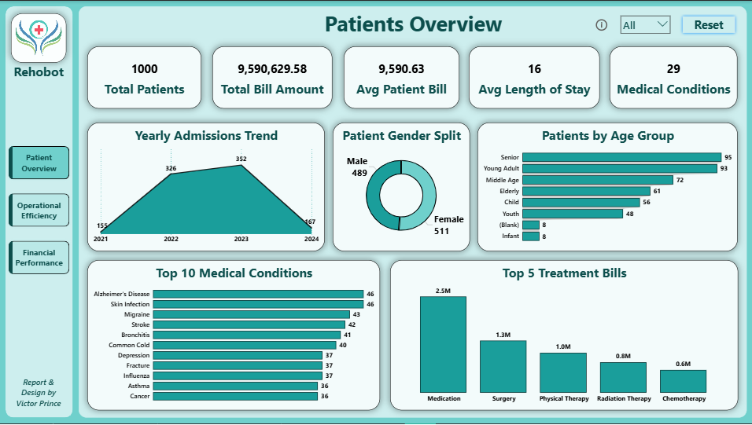
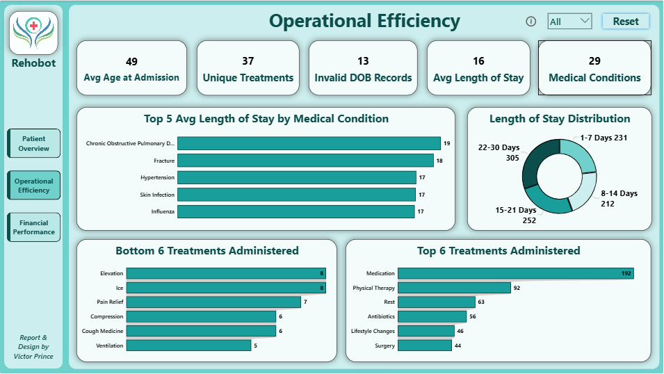
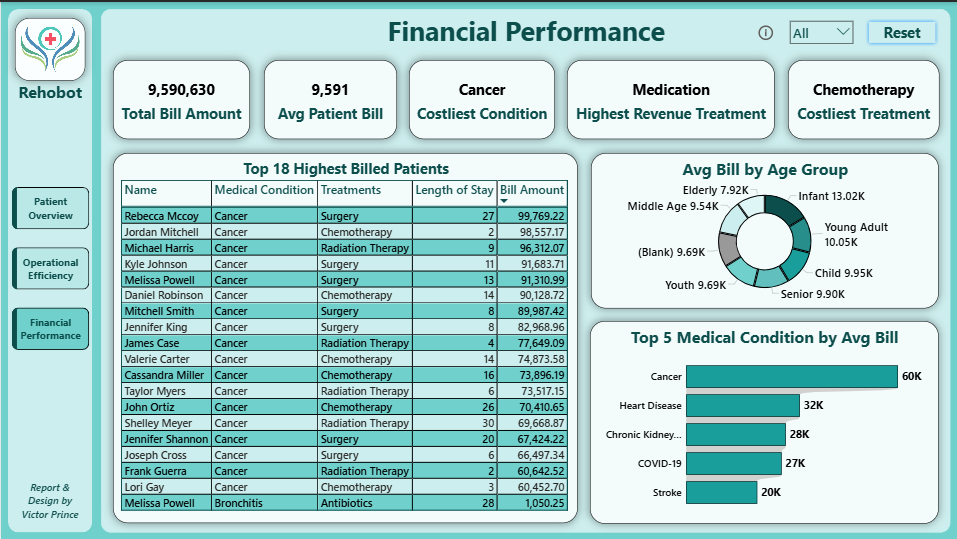

# Hospital Records 2021–2024: Operational Efficiency & Financial Performance Analysis

## Project Overview

This project analyses three years of hospital patient records spanning July 2021 to July 2024. The dataset covers 1,000 patient admissions across 29 medical conditions and 37 treatment types, providing a complete picture of patient demographics, clinical operations, and financial performance at the facility level.

The goal was to move beyond surface-level statistics and answer three real operational questions: who is being admitted and in what pattern, which conditions and treatments are driving the longest hospital stays, and where is the money going. The findings are designed to support hospital administrators in resource planning, cost management, and clinical prioritisation decisions.

---

## Business Problem

Hospital operations produce enormous volumes of data but rarely synthesise it into decisions. This analysis addresses that gap by examining three interconnected dimensions — patient demographics, length of stay efficiency, and billing performance — across a three-year window. The specific questions driving the analysis were:

- Which medical conditions generate the highest patient volume and what demographics do they affect most?
- Are certain conditions or treatments systematically driving longer hospital stays, and is that operationally justified?
- Which conditions and treatments are the primary cost drivers, and how does billing vary across patient age groups?

---

## Dataset Description

| Attribute | Detail |
|---|---|
| Source | Kaggle — Hospital Patient Records Dataset |
| Record Count | 1,000 patients |
| Time Period | July 2021 – July 2024 |
| Columns (Raw) | 10 |
| Columns (After Cleaning) | 16 |

**Original columns:** Patient ID, Name, Date of Birth, Gender, Medical Condition, Treatments, Doctor's Notes, Admit Date, Discharge Date, Bill Amount

**Derived columns added during cleaning:** Length of Stay, Age at Admission, Age Group, Admit Year, Admit Month Number, Admit Month Name

---

## Tools Used

| Tool | Purpose |
|---|---|
| Microsoft Excel + Power Query | Data cleaning, transformation, and derived column creation |
| Power BI Desktop + DAX | Dashboard development, KPI measures, and visual analysis |

---

## Data Cleaning Summary

All cleaning was performed in Power Query before the data was loaded into Power BI. The raw dataset contained no missing values across its original 10 columns, but required several structural corrections and additions before it could support reliable analysis.

**Date of Birth anomalies.** 13 records contained a Date of Birth that fell after the patient's Admit Date — a logical impossibility indicating data entry errors at the source. Rather than deleting these rows, which would have removed valid admission, condition, and billing data, the DOB field for these records was nullified using a conditional column. The records remain in the dataset and contribute to all analyses except age-related calculations, where they correctly return blank.

**Derived column: Length of Stay.** Calculated as the difference in days between Discharge Date and Admit Date using `Duration.Days()` in Power Query M. No negative or zero-day stays were found in the data.

**Derived column: Age at Admission.** Calculated from Date of Birth and Admit Date, rounded down to whole years. Records with invalid DOBs return null for this field.

**Derived column: Age Group.** Patients were banded into five groups — Child (0–17), Young Adult (18–35), Middle-Aged (36–55), Senior (56–75), and Elderly (76+). Records with null ages are flagged as Unknown.

**Derived columns: Admit Year, Admit Month Number, Admit Month Name.** Extracted from Admit Date to support time-series analysis in Power BI.

---

## Dashboard Structure

The Power BI dashboard is organised across three pages, each addressing one dimension of the analysis.

### Page 1 — Patients Overview

Covers patient volume, demographics, and condition distribution. Key visuals include a yearly admissions trend, gender split donut chart, age group distribution, and a ranked bar chart of the top 10 medical conditions by patient count.

### Page 2 — Operational Efficiency

Covers length of stay analysis and treatment activity. Key visuals include average LOS by medical condition, LOS distribution across four stay-length bands, top and bottom treatments by volume administered, and the breakdown of stays across the 22–30 day range which accounts for the largest patient share.

### Page 3 — Financial Performance

Covers billing by condition, treatment, age group, and individual patient. Key visuals include average bill by condition, a donut showing billing distribution across age groups, and a detailed table of the top 18 highest-billed patients.

---

## Key Findings

### Patient Demographics

A total of 1,000 patients were admitted over the three-year period. Female patients accounted for 51.1% of admissions against 48.9% male — a near-even split. The average patient age at admission was 49 years, with Senior patients (56–75) representing the largest single age group at 95 admissions, closely followed by Young Adults (18–35) at 93.

Admissions grew consistently from 155 in 2021 to 326 in 2022 and 352 in 2023. The 2024 figure of 167 reflects a partial year ending in July and should not be read as a decline.

### Conditions

Alzheimer's Disease and Skin Infection tied as the most frequently diagnosed conditions, each appearing in 46 patient records. Migraine followed at 43, with Stroke and Bronchitis at 42 and 41 respectively. Cancer appeared in only 36 cases but emerged as the dominant condition in both billing and treatment intensity — making it low frequency but high impact.

### Operational Efficiency

The average length of stay across all admissions was 16 days. Chronic Obstructive Pulmonary Disease recorded the longest average stay at 19 days, followed by Fracture at 18 days and Hypertension, Skin Infection, and Influenza each averaging 17 days.

Examining the distribution of stays, the 22–30 day band was the largest group with 305 patients, suggesting the facility manages a significant proportion of complex, extended-care admissions. Short-stay patients (1–7 days) numbered 231, while the mid-range bands — 8–14 days and 15–21 days — accounted for 212 and 252 patients respectively.

Medication was the most frequently administered treatment by a wide margin at 192 instances, nearly double Physical Therapy in second place at 92. Rest, Antibiotics, Lifestyle Changes, and Surgery rounded out the top six treatments.

### Financial Performance

Total billing across all 1,000 patients reached $9,590,629.58, with an average bill per patient of $9,590.63.

Cancer was the costliest medical condition by average bill at approximately $60K per patient — nearly double Heart Disease in second place at $32K. Chronic Kidney Disease ($28K), COVID-19 ($27K), and Stroke ($20K) completed the top five.

Chemotherapy was identified as the costliest treatment by average bill per patient. Medication generated the highest total revenue across all treatments, consistent with its position as the most frequently administered treatment. The top individual patient bill was $99,769.22 — a Cancer patient treated with Surgery.

Infant patients recorded the highest average bill at $13,020, followed by Young Adults at $10,050. Elderly patients had the lowest average bill at $7,920, potentially reflecting shorter stays or less intervention-intensive treatment protocols for that group.

---

## Data Limitations

13 patient records had invalid Date of Birth entries and were excluded from all age-related analysis. These records are flagged as Invalid DOB Records within the dashboard and retained in all other calculations. The 2024 data covers only half the year and admission figures for that year are not comparable to prior full years without adjustment.

---

## Dashboard Screenshots

### Patients Overview

### Operational Efficiency

### Financial Performance

---

## About the Author

**Emeka Victor Prince**
Junior Data Analyst | Co-Lead, Plasma Africa

This project is part of a structured 20-project professional portfolio covering Sales & Revenue Analytics, Healthcare Analytics, HR & Workforce Analytics, Finance & Investment Analytics, and Supply Chain & Operations Analytics — built end-to-end using Excel, Power Query, SQL Server, and Power BI.

---

*Analysis period: 2021 – 2024 | Dataset: 1000 Patients | 4 years record*
